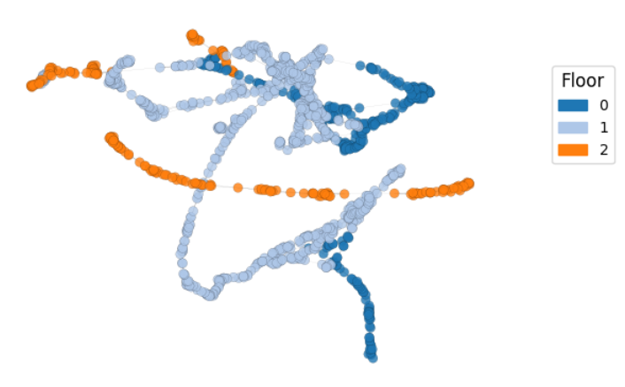
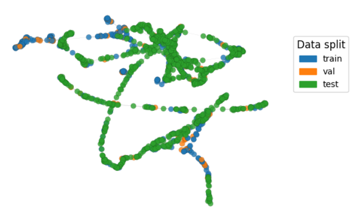
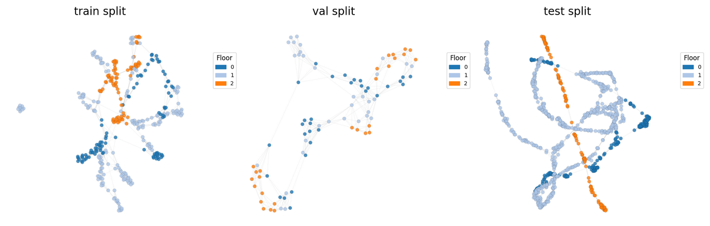

# Inductive learning scheme for WiFi fingerprinting-based indoor positioning systems

Traditionally, indoor positioning systems based on WiFi fingerprinting have relied on k-NN algorithms and, more recently, on deep learning models.

This repository contains the code for a framework developed to use **Graph Neural Networks (GNNs)** with both inductive and transductive learning schemes.

In the **transductive scheme**, a single graph is created that includes all dataset splits (train, validation, and test), whereas in the **inductive scheme**, separate graphs are constructed for each split to prevent phenomena such as *data leakage* and to enable evaluation on unseen graphs without retraining the model each time.

The framework supports preprocessing of the original datasets using linear and power normalization, as well as dimensionality reduction via PCA. It also provides flexibility in constructing k-NN graphs, allowing selection of different distance metrics (Manhattan and Cosine) and the number of nearest neighbors *k*.


### Transductive learning scheme

<table>
  <tr>
    <td align="center">
      
    </td>
    <td align="center">
      
    </td>
  </tr>
</table>

**TUT5 Dataset*

### Inductive learning scheme

<table>
  <tr>
    <td colspan="2" align="center">
      
    </td>
  </tr>
</table>

**TUT5 Dataset*

## Repository structure

* **notebooks/:** \
    Jupyter notebooks used as the working environment.

    - `evaluation.ipynb`: Optimization, training and evaluation of graph neural networks.

* **src/:** \
    Python modules containing the core classes and functions used throughout the notebooks.

   - `indoorloc_data.py`: Manages data loading and processing, including graph construction.
   - `indoorloc_optimizer.py`: Manages model optimization.
   - `indoorloc_trainer.py`: Manages model training and evaluation.
   - `indoorloc_models.py`: Contains the GNN models.
   - `indoorloc_viz.py`: Manages the generation of plots.  
   - `indoorloc_enums.py`: Contains constants and enums used in the other modules.

---

## Requirements

Install all dependencies listed in `requirements.txt`:

```bash
pip install -r requirements.txt